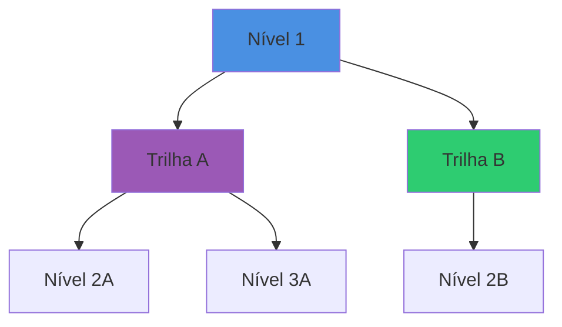

# 🎨 Guia de Customização Visual

## SuperProfessores - Como personalizar o layout

---

## 🎯 Estrutura Visual Atual

### Tema: **Just-the-Docs**

Escolhemos este tema porque:
- ✅ Perfeito para conteúdo educacional
- ✅ Navegação lateral intuitiva
- ✅ Busca integrada
- ✅ Responsivo
- ✅ Suporte a diagramas (Mermaid)

---

## 🎨 Paleta de Cores

### Cores Principais

```scss
Azul Educação (Principal):    #4a90e2
Verde (Trilha B):              #2ecc71
Roxo (Trilha A):               #9b59b6
Laranja (Destaques):           #e67e22

Cinza Escuro (Sidebar):        #2c3e50
Cinza Claro (Background):      #ecf0f1
Branco:                        #ffffff
```

### Como Mudar as Cores

Edite o arquivo: `_sass/color_schemes/superprofessores.scss`

```scss
// Mudar cor principal
$blue-300: #SUA_COR_AQUI;

// Mudar cor da Trilha A
$purple-300: #SUA_COR_AQUI;

// Mudar cor da Trilha B
$green-300: #SUA_COR_AQUI;
```

---

## 🖼️ Logo e Imagens

### Adicionar Logo

1. Crie uma imagem PNG 150x150px
2. Salve em: `assets/images/logo.png`
3. O logo já está configurado no `_config.yml`

### Criar Logo Online (Grátis)

Use estas ferramentas:

1. **Canva** (https://canva.com)
   - Template "Logo" → Busque "Educação"
   - Cores: #4a90e2 (azul)
   - Ícones sugeridos: 🎓, 🧠, 🚀, 💡

2. **Figma** (https://figma.com)
   - Arquivo gratuito
   - Exporte como PNG

3. **LogoMaker.ai** (https://logomaker.com)
   - Gerador automático com IA
   - Palavras-chave: "SuperProfessores", "IA", "Educação"

### Sugestões de Logo

**Conceito 1: Cérebro + Chip**
```
   🧠
  +💻
= 🤖🎓
```
Representa: IA + Educação

**Conceito 2: Gradiente Moderno**
```
SP (letras estilizadas)
Com gradiente azul → roxo
```

**Conceito 3: Ícone Minimalista**
```
📚 + ⚡ + 🤖
Livro + Raio + IA
```

---

## 📊 Adicionar Diagramas

### Mermaid (Já Configurado)

Use blocos Mermaid para criar diagramas:

````markdown

````

### Tipos de Diagramas Suportados

1. **Fluxogramas** (`graph TD`)
2. **Sequência** (`sequenceDiagram`)
3. **Gantt** (`gantt`)
4. **Classes** (`classDiagram`)

[Ver exemplos no site oficial](https://mermaid.js.org/syntax/examples.html)

---

## 🎨 Badges e Labels

### Badges Inline

```markdown
Trilha A
{: .label .label-purple }

180 horas
{: .label .label-blue }

NOVO
{: .label .label-green }
```

### Cores Disponíveis

- `.label-blue` (azul)
- `.label-purple` (roxo)
- `.label-green` (verde)
- `.label-yellow` (amarelo)
- `.label-red` (vermelho)

### Callouts (Caixas de Destaque)

```markdown
{: .highlight }
> Destaque importante

{: .warning }
> Atenção!

{: .note }
> Nota adicional

{: .important }
> Muito importante!

{: .new }
> Novidade!
```

---

## 🔤 Tipografia

### Tamanhos de Fonte

```markdown
# Título H1
{: .fs-9 }

Parágrafo grande
{: .fs-6 }

Parágrafo normal (padrão)

Parágrafo pequeno
{: .fs-3 }
```

### Pesos de Fonte

```markdown
Texto normal (400)
Texto leve (300)
{: .fw-300 }

Texto bold (700)
{: .fw-700 }
```

---

## 🔘 Botões

### Estilos de Botões

```markdown
[Texto do Botão](link.html){: .btn }

[Botão Primário](link.html){: .btn .btn-primary }

[Botão Roxo](link.html){: .btn .btn-purple }

[Botão Verde](link.html){: .btn .btn-green }

[Botão Outline](link.html){: .btn .btn-outline }
```

### Botões com Tamanhos

```markdown
[Botão Grande](link.html){: .btn .fs-5 }

[Botão Pequeno](link.html){: .btn .fs-3 }
```

---

## 📱 Responsividade

O tema é **automaticamente responsivo**, mas você pode controlar visibilidade por device:

```markdown
Só visível no desktop
{: .d-none .d-md-block }

Só visível no mobile
{: .d-md-none }
```

---

## 🎨 Customizações Avançadas

### 1. Adicionar CSS Customizado

Crie: `assets/css/custom.scss`

```scss
---
---

@import "{{ site.theme }}";

// Seu CSS aqui
.meu-estilo-custom {
  color: #4a90e2;
  font-weight: bold;
}
```

### 2. Mudar Fonte

No `_config.yml` ou CSS custom:

```scss
$body-font-family: 'Roboto', sans-serif;
$heading-font-family: 'Montserrat', sans-serif;
```

Não esqueça de importar do Google Fonts:

```html
<link href="https://fonts.googleapis.com/css2?family=Roboto&family=Montserrat:wght@700&display=swap" rel="stylesheet">
```

### 3. Adicionar Ícones

Use Emoji nativos:
```
🎓 📚 🧠 💡 🚀 ⚡ 🔥 ✅ ❌ 📊 📈 💼
```

Ou Font Awesome (adicione no head):
```html
<link rel="stylesheet" href="https://cdnjs.cloudflare.com/ajax/libs/font-awesome/6.4.0/css/all.min.css">
```

---

## 🖼️ Galeria de Imagens

### Criar Hero Image

Use Canva para criar uma imagem hero (1200x630px):

1. Template: "Banner do Facebook"
2. Texto: "SuperProfessores"
3. Subtítulo: "Transformando Educadores"
4. Background: Gradiente azul → roxo
5. Ícones: 🧠🤖📚

Salve em: `assets/images/hero.png`

Adicione no topo do index.md:

```markdown

```

---

## 🎥 Adicionar Vídeo

### YouTube Embed

```markdown
<iframe width="560" height="315" src="https://www.youtube.com/embed/VIDEO_ID" frameborder="0" allowfullscreen></iframe>
```

### Vídeo Responsivo

```html
<div class="video-container">
  <iframe src="https://www.youtube.com/embed/VIDEO_ID" frameborder="0" allowfullscreen></iframe>
</div>

<style>
.video-container {
  position: relative;
  padding-bottom: 56.25%;
  height: 0;
  overflow: hidden;
}
.video-container iframe {
  position: absolute;
  top: 0;
  left: 0;
  width: 100%;
  height: 100%;
}
</style>
```

---

## 📊 Adicionar Google Analytics

No `_config.yml`:

```yaml
google_analytics: G-XXXXXXXXXX
```

Obtenha seu código em: https://analytics.google.com

---

## 🔧 Ferramentas Úteis

### Design
- **Canva** - https://canva.com (logos, banners)
- **Figma** - https://figma.com (design profissional)
- **Coolors** - https://coolors.co (paletas de cores)

### Ícones
- **Flaticon** - https://flaticon.com (ícones gratuitos)
- **Font Awesome** - https://fontawesome.com (ícones web)
- **Iconify** - https://iconify.design (busca universal)

### Imagens
- **Unsplash** - https://unsplash.com (fotos gratuitas)
- **Pexels** - https://pexels.com (vídeos e fotos)
- **Remove.bg** - https://remove.bg (remover fundo)

### Mockups
- **Smartmockups** - https://smartmockups.com (mockups de devices)
- **Placeit** - https://placeit.net (templates profissionais)

---

## 🚀 Publicar Mudanças

Após fazer customizações:

```bash
# Adicione os arquivos
git add _config.yml _sass/ assets/

# Commit
git commit -m "Customiza visual do site"

# Push
git push

# Aguarde 1-2 minutos para o GitHub Pages rebuildar
```

---

## 💡 Inspirações

Sites educacionais com ótimo design:

1. **Khan Academy** - https://khanacademy.org
2. **Coursera** - https://coursera.org
3. **freeCodeCamp** - https://freecodecamp.org
4. **MDN Web Docs** - https://developer.mozilla.org

---

## 📞 Precisa de Ajuda?

- [Documentação Just-the-Docs](https://just-the-docs.com/)
- [GitHub Pages Docs](https://docs.github.com/pages)
- [Mermaid Docs](https://mermaid.js.org/)

---

{: .highlight }
> **Dica:** Comece simples e vá customizando aos poucos. Um site bonito é importante, mas conteúdo de qualidade é essencial!
