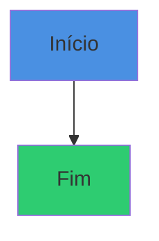

# 🏗️ Estrutura do Site SuperProfessores

## Arquitetura e Organização

---

## 📁 Estrutura de Arquivos

```
SuperProf/
├── 📄 index.md                    # Página inicial (Home)
├── 📄 _config.yml                 # Configurações do Jekyll
├── 📄 .gitignore                  # Arquivos ignorados pelo Git
├── 📄 README.md                   # Documentação do projeto (GitHub)
├── 📄 GUIA_GITHUB_PAGES.md        # Como publicar no GitHub Pages
├── 📄 CUSTOMIZACAO_VISUAL.md      # Guia de personalização visual
├── 📄 ESTRUTURA_SITE.md           # Este arquivo
│
├── 📂 _sass/                      # Estilos CSS
│   └── 📂 color_schemes/
│       └── superprofessores.scss  # Paleta de cores customizada
│
├── 📂 assets/                     # Recursos estáticos
│   ├── 📂 images/                 # Imagens (logo, hero, etc.)
│   └── 📂 css/                    # CSS adicional
│
├── 📂 doc/                        # Documentação completa
│   ├── index.md                   # Página índice da documentação
│   ├── superprofessores_modelo_hibrido_2025.md
│   ├── comparacao_trilhas.md
│   ├── sumario_executivo_visual.md
│   └── 📂 proposta_curso_ia_final/  # Proposta original (histórico)
│       ├── README_expandido.md
│       ├── sumario_executivo_expandido.md
│       ├── proposta_curso_final_expandida.md
│       ├── proposta_curso_expandida.md
│       ├── analise_documento.md
│       ├── pesquisa_frameworks_cursos.md
│       └── pesquisa_conteudos_avancados.md
│
└── 📂 node_modules/               # Dependências (não commitado)
```

---

## 🎨 Tema e Layout

### Tema: Just-the-Docs

**Arquivo de configuração:** `_config.yml`

#### Características:
- ✅ Navegação lateral automática
- ✅ Busca integrada
- ✅ Breadcrumbs
- ✅ Responsivo
- ✅ Suporte a Mermaid (diagramas)
- ✅ Syntax highlighting

#### Estrutura de Navegação:

```
Home (/)
├── Documentação (/doc)
│   ├── Proposta Completa
│   ├── Comparação de Trilhas
│   ├── Sumário Executivo
│   └── Proposta Original (histórico)
└── Links Externos
    ├── GitHub
    └── Contato (email)
```

---

## 📄 Páginas Principais

### 1. **index.md** - Home Page

**Localização:** `/index.md`
**URL:** `https://inematds.github.io/SuperProf/`

**Conteúdo:**
- Hero section com CTAs
- Problema e solução
- Escolha de trilhas (A e B)
- Dados de mercado
- Estrutura do programa
- Status do projeto

**Front Matter:**
```yaml
---
layout: default
title: Home
nav_order: 1
description: "..."
permalink: /
---
```

---

### 2. **doc/index.md** - Documentação

**Localização:** `/doc/index.md`
**URL:** `https://inematds.github.io/SuperProf/doc/`

**Conteúdo:**
- Índice de todos os documentos
- Links para proposta completa
- Navegação por tópico
- Guias para diferentes públicos

**Front Matter:**
```yaml
---
layout: default
title: Documentação
nav_order: 2
has_children: true
permalink: /doc
---
```

---

### 3. **Proposta Completa**

**Localização:** `/doc/superprofessores_modelo_hibrido_2025.md`
**URL:** `https://inematds.github.io/SuperProf/doc/superprofessores_modelo_hibrido_2025.html`

**Conteúdo (30 páginas):**
- Contexto da mudança rápida
- Visão geral do projeto
- Nível 1: Fundamentos
- Trilha A completa
- Trilha B completa
- Certificações, ROI, Roadmap

---

### 4. **Comparação de Trilhas**

**Localização:** `/doc/comparacao_trilhas.md`
**URL:** `https://inematds.github.io/SuperProf/doc/comparacao_trilhas.html`

**Conteúdo:**
- Tabelas comparativas
- FAQ interativo
- Guia de decisão
- Perfis recomendados

---

### 5. **Sumário Executivo**

**Localização:** `/doc/sumario_executivo_visual.md`
**URL:** `https://inematds.github.io/SuperProf/doc/sumario_executivo_visual.html`

**Conteúdo:**
- Diagramas e visualizações
- Dados de mercado
- ROI e investimento
- KPIs de sucesso

---

## 🎨 Sistema de Cores

### Paleta Principal

| Cor | Hex | Uso |
|-----|-----|-----|
| Azul Educação | `#4a90e2` | Principal, links |
| Verde | `#2ecc71` | Trilha B |
| Roxo | `#9b59b6` | Trilha A |
| Laranja | `#e67e22` | Destaques |
| Cinza Escuro | `#2c3e50` | Sidebar |
| Cinza Claro | `#ecf0f1` | Background |

### Como Aplicar Cores

```markdown
# Texto Roxo (Trilha A)
{: .text-purple-300 }

# Texto Verde (Trilha B)
{: .text-green-300 }

[Botão Roxo](link.html){: .btn .btn-purple }
[Botão Verde](link.html){: .btn .btn-green }
```

---

## 🔧 Componentes Reutilizáveis

### Botões

```markdown
[Texto](link.html){: .btn }                    # Padrão
[Texto](link.html){: .btn .btn-primary }       # Primário (azul)
[Texto](link.html){: .btn .btn-purple }        # Roxo
[Texto](link.html){: .btn .btn-green }         # Verde
[Texto](link.html){: .btn .btn-outline }       # Outline
```

### Labels

```markdown
Novo
{: .label .label-blue }

180h
{: .label .label-purple }

Gratuito
{: .label .label-green }
```

### Callouts

```markdown
{: .highlight }
> Destaque importante

{: .warning }
> Atenção!

{: .note }
> Nota informativa

{: .important }
> Muito importante!

{: .new }
> Novidade!
```

### Tabelas

```markdown
| Coluna 1 | Coluna 2 | Coluna 3 |
|:---------|:--------:|---------:|
| Esquerda | Centro   | Direita  |
```

### Diagramas (Mermaid)

````markdown

````

---

## 📱 Responsividade

### Breakpoints

- **Mobile:** < 768px
- **Tablet:** 768px - 1024px
- **Desktop:** > 1024px

### Classes Responsivas

```markdown
Só desktop
{: .d-none .d-md-block }

Só mobile
{: .d-md-none }
```

---

## 🔍 SEO e Metadados

### Configurado no `_config.yml`

```yaml
title: SuperProfessores
description: Transformando educadores em arquitetos do futuro da aprendizagem
url: https://inematds.github.io
baseurl: /SuperProf
```

### Por Página (Front Matter)

```yaml
---
title: Título da Página
description: Descrição para SEO
---
```

### Plugins SEO

- `jekyll-seo-tag` - Metadados automáticos
- `jekyll-sitemap` - Sitemap XML automático
- `jekyll-feed` - RSS feed automático

---

## 🧪 Testar Localmente

### Opção 1: Com Ruby e Jekyll

```bash
# Instalar dependências
gem install bundler jekyll

# Criar Gemfile
cat > Gemfile << 'EOF'
source "https://rubygems.org"
gem "jekyll", "~> 4.3"
gem "just-the-docs"
gem "webrick"
EOF

# Instalar
bundle install

# Rodar servidor local
bundle exec jekyll serve

# Acesse: http://localhost:4000/SuperProf/
```

### Opção 2: Com Docker (mais fácil)

```bash
# Baixar imagem
docker pull jekyll/jekyll

# Rodar servidor
docker run --rm -v $(pwd):/srv/jekyll -p 4000:4000 jekyll/jekyll jekyll serve

# Acesse: http://localhost:4000/SuperProf/
```

### Opção 3: GitHub Codespaces (na nuvem)

1. Vá para o repositório no GitHub
2. Clique em "Code" → "Codespaces" → "Create codespace"
3. No terminal: `bundle exec jekyll serve`
4. Codespaces abrirá a preview automaticamente

---

## 🚀 Processo de Deploy

### Workflow Automático

Quando você faz `git push`:

1. GitHub detecta mudanças
2. GitHub Actions executa:
   - Instala Jekyll
   - Processa Markdown → HTML
   - Compila SCSS → CSS
   - Gera sitemap e RSS
3. Deploy para GitHub Pages
4. Site atualizado em 1-2 minutos

### Verificar Status do Deploy

1. Vá para: `https://github.com/inematds/SuperProf/actions`
2. Veja o último workflow run
3. Se verde ✅ = sucesso
4. Se vermelho ❌ = erro (veja logs)

---

## 🔧 Manutenção

### Adicionar Nova Página

1. Crie arquivo `.md` na pasta apropriada
2. Adicione front matter:

```yaml
---
layout: default
title: Título da Página
nav_order: 3
parent: Documentação  # Se é subpágina
---
```

3. Escreva conteúdo em Markdown
4. Commit e push

### Atualizar Conteúdo Existente

1. Edite o arquivo `.md`
2. Commit e push
3. Aguarde rebuild (1-2 min)

### Mudar Ordem de Navegação

No front matter de cada página:

```yaml
nav_order: 1  # Menor número = mais acima
```

---

## 📊 Analytics e Métricas

### Google Analytics (Recomendado)

1. Crie conta em: https://analytics.google.com
2. Obtenha seu `Measurement ID` (G-XXXXXXXXXX)
3. Adicione no `_config.yml`:

```yaml
google_analytics: G-XXXXXXXXXX
```

### GitHub Insights (Grátis)

Veja em: `https://github.com/inematds/SuperProf/graphs/traffic`

- Visitantes únicos
- Views
- Clones
- Referrers

---

## 🐛 Troubleshooting

### Problema: Página 404

**Causa:** Link quebrado ou baseurl incorreto

**Solução:**
- Verifique links relativos: `[Texto](../pasta/arquivo.html)`
- Ou use absolutos: `[Texto]({{ site.baseurl }}/pasta/arquivo.html)`

### Problema: CSS não carrega

**Causa:** Baseurl incorreto

**Solução:**
- Verifique `_config.yml`:
```yaml
baseurl: "/SuperProf"  # Com barra inicial, SEM barra final
```

### Problema: Mermaid não renderiza

**Causa:** Sintaxe incorreta ou versão desatualizada

**Solução:**
- Verifique sintaxe em: https://mermaid.live
- Atualize versão no `_config.yml`

### Problema: Build falha

**Causa:** Erro de sintaxe ou plugin faltando

**Solução:**
1. Veja logs em GitHub Actions
2. Teste localmente
3. Verifique front matter (YAML válido)

---

## 📚 Recursos Úteis

### Documentação Oficial
- [Jekyll Docs](https://jekyllrb.com/docs/)
- [Just-the-Docs Theme](https://just-the-docs.com/)
- [GitHub Pages Docs](https://docs.github.com/pages)
- [Mermaid Docs](https://mermaid.js.org/)

### Tutoriais
- [Markdown Guide](https://www.markdownguide.org/)
- [YAML Cheat Sheet](https://quickref.me/yaml.html)

---

## 🎯 Checklist de Lançamento

Antes de lançar oficialmente:

- [ ] Testar todas as páginas localmente
- [ ] Verificar todos os links (internos e externos)
- [ ] Adicionar logo
- [ ] Configurar Google Analytics
- [ ] Testar em mobile
- [ ] Verificar SEO (meta descriptions)
- [ ] Adicionar favicon
- [ ] Fazer backup do código
- [ ] Anunciar lançamento!

---

## 📞 Suporte

- **Documentação:** Este arquivo + `CUSTOMIZACAO_VISUAL.md`
- **Issues:** https://github.com/inematds/SuperProf/issues
- **Email:** inematds@gmail.com

---

{: .important }
> **Dica Final:** Mantenha a estrutura simples. É melhor ter conteúdo excelente com design simples do que design complexo com conteúdo fraco!
