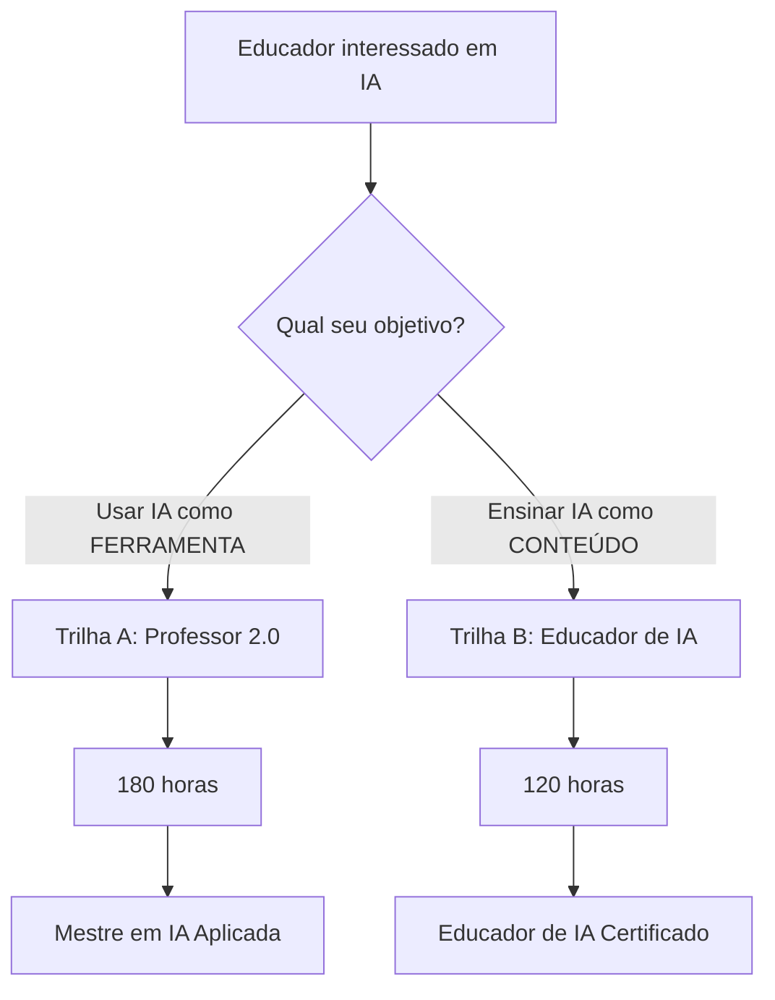

# 📊 SuperProfessores - Sumário Executivo Visual

## Versão 3.0 (Modelo Híbrido) - Novembro 2025

---

## 🎯 O Problema

### A Velocidade da Evolução da IA é Sem Precedentes

```
📅 Últimos 4 meses (Jul-Nov 2025):

Julho ──→ ChatGPT Study Mode lançado
Agosto ──→ Claude Learning Mode lançado
Agosto ──→ Gemini Guided Learning lançado
Novembro ──→ Microsoft Study & Learn lançado
Novembro ──→ NotebookLM áudio/vídeo lançado
```

### Dados do Mercado (2025)

| Métrica | 2024 | 2025 | Crescimento |
|---------|------|------|-------------|
| **Mercado Global** | USD 5.47bi | USD 7.57bi | **+38.4%** |
| **Adoção Estudantil** | 66% | 92% | **+26 pts** |
| **Projeção 2034** | - | USD 208.2bi | CAGR 41.4% |

### O Desafio

> **Tempo médio de obsolescência de uma ferramenta de IA:** 4-6 meses

**Cursos tradicionais ficam desatualizados antes de terminar!**

---

## 💡 Nossa Solução

### Ensinar PRINCÍPIOS, não FERRAMENTAS

```
❌ Curso Tradicional:
   "Clique aqui no ChatGPT para fazer X"
   (Obsoleto em 6 meses)

✅ SuperProfessores:
   "Use IA generativa para fazer X porque Y (princípio)"
   (Funciona em qualquer ferramenta, por anos)
```

### 3 Pilares da Resiliência

1. **Princípios Atemporais** (80% do conteúdo)
   - Prompt engineering universal
   - Pensamento crítico
   - Ética e privacidade
   - Design instrucional

2. **Living Updates** (20% do conteúdo)
   - Atualizado trimestralmente
   - Estado da arte atual
   - Comparativos de ferramentas

3. **Comunidade Viva**
   - Webinars mensais
   - Newsletter semanal
   - Slack/Discord ativo

---

## 🎓 Modelo Híbrido: 2 Objetivos Diferentes

### A Pergunta-Chave

**O que você quer fazer com IA?**



---

## 📘 Estrutura do Programa

### Visão Geral

```
┌─────────────────────────────────────────────────────────┐
│ NÍVEL 1: FUNDAMENTOS (60h) - OBRIGATÓRIO PARA AMBAS    │
│                                                         │
│ • Ecossistema de IA (Nov 2025)                         │
│ • Prompt Engineering Universal                          │
│ • Pensamento Crítico                                    │
│ • Projeto Prático                                       │
└─────────────────────────────────────────────────────────┘
                         │
         ┌───────────────┴───────────────┐
         │                               │
         ▼                               ▼
┌──────────────────────┐    ┌──────────────────────┐
│ TRILHA A             │    │ TRILHA B             │
│ Professor 2.0        │    │ Educador de IA       │
│                      │    │                      │
│ Nível 2A (60h)       │    │ Nível 2B (60h)       │
│ • IA Generativa      │    │ • Didática de IA     │
│ • Learning Analytics │    │ • Currículos/Idade   │
│ • Design Auto        │    │ • Ferramentas Edu    │
│ • Chatbots No-Code   │    │ • Projetos Alunos    │
│                      │    │                      │
│ Nível 3A (60h)       │    └──────────────────────┘
│ • Estratégia         │              │
│ • ROI & Governança   │              │
│ • Liderança          │              ▼
│ • Multiplicadores    │    ┌──────────────────────┐
│                      │    │ 120h TOTAL           │
└──────────────────────┘    │ Educador de IA       │
         │                  └──────────────────────┘
         ▼
┌──────────────────────┐
│ 180h TOTAL           │
│ Mestre em IA         │
└──────────────────────┘
```

---

## 🔵 Trilha A: Professor 2.0 (180h)

### Para Quem?

👨‍🏫 Professor de qualquer disciplina
👩‍💼 Gestores e coordenadores
🎯 Objetivo: Produtividade + Inovação

### O Que Você Aprende?

| Nível | Foco | Habilidades |
|-------|------|-------------|
| **1** (60h) | **Fundamentos** | • Dominar ferramentas<br>• Prompt engineering<br>• Pensamento crítico |
| **2A** (60h) | **Avançado** | • IA multimodal<br>• Learning analytics<br>• Chatbots no-code<br>• Design automatizado |
| **3A** (60h) | **Liderança** | • Estratégia institucional<br>• Cálculo de ROI<br>• Gestão da mudança<br>• Formação de equipes |

### Ferramentas Principais

- ChatGPT, Claude, Gemini
- Microsoft Copilot + Study & Learn
- Google NotebookLM
- Canva Magic Write
- Dialogflow, Voiceflow (chatbots)
- Dashboards de Learning Analytics

### Resultado Final

✅ Economiza 30-50% do tempo em tarefas administrativas
✅ Cria conteúdo personalizado em minutos
✅ Implementa IA em toda a escola
✅ Lidera transformação digital

---

## 🟢 Trilha B: Educador de IA (120h)

### Para Quem?

👨‍💻 Professor de Computação, Robótica, STEM
🔬 Professor de Ciências e Matemática
🎯 Objetivo: Ensinar IA para alunos

### O Que Você Aprende?

| Nível | Foco | Habilidades |
|-------|------|-------------|
| **1** (60h) | **Fundamentos** | • Dominar ferramentas<br>• Prompt engineering<br>• Pensamento crítico |
| **2B** (60h) | **Ensino de IA** | • Didática de IA<br>• Atividades unplugged<br>• Currículos por idade<br>• Projetos estudantis<br>• Avaliação |

### Ferramentas Principais

- Scratch for AI (MIT)
- Teachable Machine (Google)
- AI4K12 (Stanford)
- Code.org AI Curriculum
- MIT App Inventor com ML
- Quick, Draw! (Google)

### Resultado Final

✅ Ensina IA para Fund I, II e Médio
✅ Orienta projetos de ciência com IA
✅ Prepara alunos para competições
✅ Desenvolve pensamento computacional

---

## 📊 Comparação Lado a Lado

| Aspecto | Trilha A 🔵 | Trilha B 🟢 |
|---------|-------------|-------------|
| **Carga** | 180h (3 níveis) | 120h (2 níveis) |
| **Foco** | Usar IA | Ensinar IA |
| **Público** | Todos os professores | STEM, Computação |
| **Programação** | ❌ No-code apenas | ✅ Python básico |
| **Liderança** | ✅ Nível 3A dedicado | ❌ Não tem |
| **Didática** | ❌ Não é foco | ✅ Central |
| **ROI Institucional** | ✅ Sim | ❌ Não |
| **Projetos Alunos** | ❌ Não | ✅ Sim |

### Exemplos de Uso

| Situação | Trilha A | Trilha B |
|----------|----------|----------|
| Criar prova de História | ✅ ChatGPT gera 20 questões | ❌ Não aplicável |
| Ensinar ML para crianças | ❌ Não aplicável | ✅ Teachable Machine |
| Automatizar feedback | ✅ IA corrige redações | ❌ Não aplicável |
| Feira de ciências | ❌ Não aplicável | ✅ Orienta projeto de IA |
| Transformação digital | ✅ Roadmap institucional | ❌ Não aplicável |

---

## 🇧🇷 Contexto Brasileiro

### Dados do Brasil (2025)

- **74.8%** dos professores apoiam uso de IA
- **EdTechs brasileiras** adotando IA em larga escala
- **GPT-4 em português**: 90% de acurácia (vs 73% outros)
- **Google Meet** com transcrição em português (Nov 2025)

### Alinhamento

✅ **BNCC** - Competências digitais
✅ **LGPD** - Privacidade de dados
✅ **Ferramentas** - Todas com suporte em português
✅ **Cases** - Exemplos de escolas brasileiras

---

## 🎓 Certificações

### Progressão

```
Nível 1 (60h)
└─→ SuperProfessor Fundamentos em IA
    │
    ├─→ TRILHA A ──────────────────────┐
    │   │                              │
    │   Nível 2A (120h acum)           │
    │   └─→ SuperProfessor Avançado    │
    │       │                          │
    │       Nível 3A (180h acum)       │
    │       └─→ Mestre em IA Aplicada──┼─→ AMBAS (240h)
    │                                  │   └─→ Grande Mestre
    └─→ TRILHA B ──────────────────────┘       em IA Educacional
        │
        Nível 2B (120h acum)
        └─→ Educador de IA Certificado
```

---

## 💰 Investimento e ROI

### Investimento por Professor

| Item | Custo |
|------|-------|
| **Ferramentas** | **R$ 0** (100% gratuitas) |
| **Plataforma** | A definir (LMS) |
| **Tempo** | 120-180h (8-12 meses) |

### ROI Esperado

#### 👨‍🏫 Para o Professor

- ⏱️ **30-50% menos tempo** em tarefas admin
- 📈 **Aumento de engajamento** estudantil
- 🏆 **Reconhecimento** profissional
- 💼 **Novas oportunidades** de carreira

#### 🏫 Para a Escola

- 🎯 **Diferenciação** competitiva
- 💡 **Cultura de inovação**
- 📊 **Melhores resultados** de aprendizagem
- 💰 **Redução de custos** operacionais

#### 🎓 Para os Alunos

- 📚 **Aprendizagem personalizada**
- 🚀 **Competências do século XXI**
- 🌍 **Preparação para o futuro**

---

## 🚀 Diferenciais Competitivos

### 1. ⚡ Resiliência à Mudança

**Problema**: Ferramentas mudam a cada 4-6 meses
**Solução**: Ensinamos princípios atemporais

### 2. 🎯 2 Trilhas Especializadas

**Problema**: "Usar IA" ≠ "Ensinar IA"
**Solução**: Duas especializações independentes

### 3. 🇧🇷 Contextualização Brasileira

**Problema**: Cursos internacionais não servem
**Solução**: BNCC, LGPD, português, cases BR

### 4. 🔬 Baseado em Evidências

**Problema**: Cursos superficiais
**Solução**: UNESCO, Stanford, Harvard, MIT

### 5. 🛠️ 100% Prático

**Problema**: Muito conceito, pouca prática
**Solução**: Projetos em todos os níveis

### 6. 🤝 Comunidade Viva

**Problema**: Isolamento pós-curso
**Solução**: Webinars, Slack, biblioteca, mentoria

---

## 📅 Roadmap de Lançamento

```
Q4 2025 (Nov-Dez)
├── ✅ Pesquisa de mercado
├── ✅ Estruturação do modelo
└── ✅ Documentação completa

Q1 2026 (Jan-Mar)
├── 🔄 Desenvolvimento Nível 1
├── 🔄 Seleção de plataforma LMS
├── 🔄 Criação de materiais
└── 🔄 Turma piloto (50 educadores)

Q2 2026 (Abr-Jun)
├── 📅 Feedback e ajustes
├── 📅 Desenvolvimento Nível 2A
└── 📅 Soft launch Trilha A

Q3 2026 (Jul-Set)
├── 📅 Desenvolvimento Nível 2B
├── 📅 Lançamento Trilha B
└── 📅 Parcerias com escolas

Q4 2026 (Out-Dez)
├── 📅 Desenvolvimento Nível 3A
├── 📅 Escala nacional
└── 📅 500+ educadores formados
```

---

## 📊 KPIs de Sucesso

### Métricas de Impacto

| Métrica | Meta Ano 1 | Meta Ano 2 |
|---------|-----------|-----------|
| **Educadores Formados** | 500 | 2.000 |
| **Escolas Parceiras** | 20 | 100 |
| **NPS (satisfação)** | >70 | >80 |
| **Taxa de Conclusão** | >80% | >85% |
| **Projetos Implementados** | 300 | 1.500 |

### Indicadores de Qualidade

- ✅ 90%+ dos professores reportam **economia de tempo**
- ✅ 80%+ implementam **projetos na escola**
- ✅ 70%+ se tornam **multiplicadores**
- ✅ 60%+ continuam para **certificação completa**

---

## 🤝 Parceiros Estratégicos (Prospecção)

### Tecnologia
- 🤝 OpenAI, Anthropic, Google (ferramentas)
- 🤝 Microsoft Education (Copilot)
- 🤝 EdTechs Brasileiras (cases de sucesso)

### Educação
- 🤝 Ministério da Educação (MEC)
- 🤝 Secretarias Estaduais de Educação
- 🤝 CIEB (Centro de Inovação para Educação Brasileira)

### Academia
- 🤝 Universidades (certificação)
- 🤝 Stanford, MIT (frameworks)
- 🤝 UNESCO (diretrizes)

---

## 📞 Call to Action

### Para Educadores

**🎓 Faça Parte da Primeira Turma!**

- [📝 Manifestar Interesse](https://forms.gle/xxx)
- [📖 Ler Proposta Completa](superprofessores_modelo_hibrido_2025.md)
- [🆚 Comparar Trilhas](comparacao_trilhas.md)

### Para Escolas

**🏫 Traga o SuperProfessores para Sua Rede!**

- [📧 Contato Institucional](mailto:inematds@gmail.com)
- [📋 Proposta Customizada](#)
- [💼 Cases de Sucesso](#)

### Para Desenvolvedores

**💻 Contribua com o Projeto!**

- [⭐ GitHub](https://github.com/inematds/SuperProf)
- [🤝 Como Contribuir](../CONTRIBUTING.md)
- [📚 Documentação Técnica](#)

---

## 📚 Recursos Adicionais

- [📖 Proposta Completa (30 páginas)](superprofessores_modelo_hibrido_2025.md)
- [🆚 Comparação Detalhada das Trilhas](comparacao_trilhas.md)
- [🎥 Vídeo de Apresentação](#) (em breve)
- [📊 Slides Executivos](#) (em breve)
- [❓ FAQ Completo](#) (em breve)

---

## 📬 Contato

**Email**: inematds@gmail.com
**GitHub**: [@inematds](https://github.com/inematds)
**Projeto**: [SuperProf](https://github.com/inematds/SuperProf)

---

<div align="center">

## 🚀 A Revolução da IA na Educação Começa Agora!

**SuperProfessores** não é só um curso. É um **movimento**.

> *"A única constante na IA é a mudança. Por isso, ensinamos a dançar com a mudança, não a lutar contra ela."*

**[📖 Leia Mais](superprofessores_modelo_hibrido_2025.md)** | **[⭐ GitHub](https://github.com/inematds/SuperProf)** | **[🤝 Contribua](../CONTRIBUTING.md)**

---

**Última atualização**: Novembro 2025 | **Versão**: 3.0 (Modelo Híbrido)

</div>
